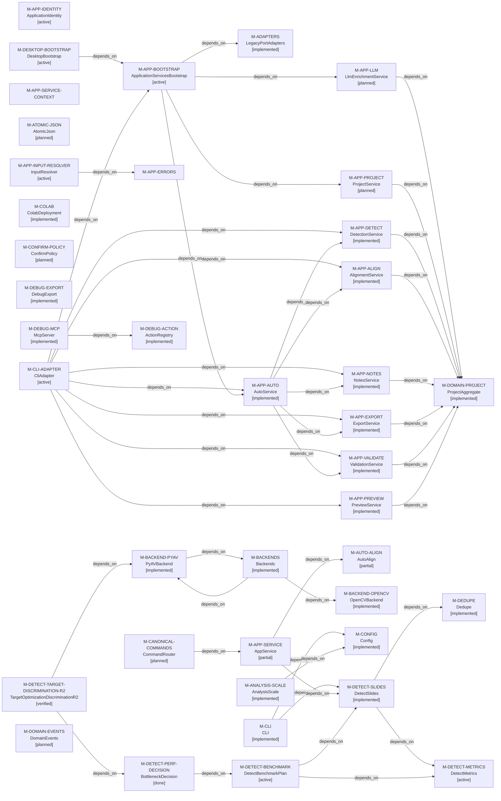

# GRACE Module Dependencies

```mermaid
%% GRACE Module Dependencies
flowchart LR
  M_ADAPTERS["M-ADAPTERS<br/>LegacyPortAdapters<br/>[implemented]"]
  M_ANALYSIS_SCALE["M-ANALYSIS-SCALE<br/>AnalysisScale<br/>[implemented]"]
  M_APP_ALIGN["M-APP-ALIGN<br/>AlignmentService<br/>[implemented]"]
  M_APP_AUTO["M-APP-AUTO<br/>AutoService<br/>[implemented]"]
  M_APP_BOOTSTRAP["M-APP-BOOTSTRAP<br/>ApplicationServicesBootstrap<br/>[active]"]
  M_APP_DETECT["M-APP-DETECT<br/>DetectionService<br/>[implemented]"]
  M_APP_ERRORS["M-APP-ERRORS<br/>"]
  M_APP_EXPORT["M-APP-EXPORT<br/>ExportService<br/>[implemented]"]
  M_APP_IDENTITY["M-APP-IDENTITY<br/>ApplicationIdentity<br/>[active]"]
  M_APP_INPUT_RESOLVER["M-APP-INPUT-RESOLVER<br/>InputResolver<br/>[active]"]
  M_APP_LLM["M-APP-LLM<br/>LlmEnrichmentService<br/>[planned]"]
  M_APP_NOTES["M-APP-NOTES<br/>NotesService<br/>[implemented]"]
  M_APP_PREVIEW["M-APP-PREVIEW<br/>PreviewService<br/>[implemented]"]
  M_APP_PROJECT["M-APP-PROJECT<br/>ProjectService<br/>[planned]"]
  M_APP_SERVICE["M-APP-SERVICE<br/>AppService<br/>[partial]"]
  M_APP_SERVICE_CONTEXT["M-APP-SERVICE-CONTEXT<br/>"]
  M_APP_VALIDATE["M-APP-VALIDATE<br/>ValidationService<br/>[implemented]"]
  M_ATOMIC_JSON["M-ATOMIC-JSON<br/>AtomicJson<br/>[planned]"]
  M_AUTO_ALIGN["M-AUTO-ALIGN<br/>AutoAlign<br/>[partial]"]
  M_BACKEND_OPENCV["M-BACKEND-OPENCV<br/>OpenCVBackend<br/>[implemented]"]
  M_BACKEND_PYAV["M-BACKEND-PYAV<br/>PyAVBackend<br/>[implemented]"]
  M_BACKENDS["M-BACKENDS<br/>Backends<br/>[implemented]"]
  M_CANONICAL_COMMANDS["M-CANONICAL-COMMANDS<br/>CommandRouter<br/>[planned]"]
  M_CLI["M-CLI<br/>CLI<br/>[implemented]"]
  M_CLI_ADAPTER["M-CLI-ADAPTER<br/>CliAdapter<br/>[active]"]
  M_COLAB["M-COLAB<br/>ColabDeployment<br/>[implemented]"]
  M_CONFIG["M-CONFIG<br/>Config<br/>[implemented]"]
  M_CONFIRM_POLICY["M-CONFIRM-POLICY<br/>ConfirmPolicy<br/>[planned]"]
  M_DEBUG_ACTION["M-DEBUG-ACTION<br/>ActionRegistry<br/>[implemented]"]
  M_DEBUG_EXPORT["M-DEBUG-EXPORT<br/>DebugExport<br/>[implemented]"]
  M_DEBUG_MCP["M-DEBUG-MCP<br/>McpServer<br/>[implemented]"]
  M_DEDUPE["M-DEDUPE<br/>Dedupe<br/>[implemented]"]
  M_DESKTOP_BOOTSTRAP["M-DESKTOP-BOOTSTRAP<br/>DesktopBootstrap<br/>[active]"]
  M_DETECT_BENCHMARK["M-DETECT-BENCHMARK<br/>DetectBenchmarkPlan<br/>[active]"]
  M_DETECT_METRICS["M-DETECT-METRICS<br/>DetectMetrics<br/>[active]"]
  M_DETECT_PERF_DECISION["M-DETECT-PERF-DECISION<br/>BottleneckDecision<br/>[done]"]
  M_DETECT_SLIDES["M-DETECT-SLIDES<br/>DetectSlides<br/>[implemented]"]
  M_DETECT_TARGET_DISCRIMINATION_R2["M-DETECT-TARGET-DISCRIMINATION-R2<br/>TargetOptimizationDiscriminationR2<br/>[verified]"]
  M_DOMAIN_EVENTS["M-DOMAIN-EVENTS<br/>DomainEvents<br/>[planned]"]
  M_DOMAIN_PROJECT["M-DOMAIN-PROJECT<br/>ProjectAggregate<br/>[implemented]"]

  M_CLI -->|depends_on| M_CONFIG
  M_CLI -->|depends_on| M_DETECT_SLIDES
  M_BACKENDS -->|depends_on| M_BACKEND_OPENCV
  M_BACKENDS -->|depends_on| M_BACKEND_PYAV
  M_DETECT_SLIDES -->|depends_on| M_DEDUPE
  M_DETECT_SLIDES -->|depends_on| M_DETECT_METRICS
  M_DEBUG_MCP -->|depends_on| M_DEBUG_ACTION
  M_APP_SERVICE -->|depends_on| M_DETECT_SLIDES
  M_APP_SERVICE -->|depends_on| M_AUTO_ALIGN
  M_CANONICAL_COMMANDS -->|depends_on| M_APP_SERVICE
  M_APP_INPUT_RESOLVER -->|depends_on| M_APP_ERRORS
  M_DESKTOP_BOOTSTRAP -->|depends_on| M_APP_BOOTSTRAP
  M_DETECT_BENCHMARK -->|depends_on| M_DETECT_SLIDES
  M_DETECT_BENCHMARK -->|depends_on| M_DETECT_METRICS
  M_DETECT_PERF_DECISION -->|depends_on| M_DETECT_BENCHMARK
  M_DETECT_TARGET_DISCRIMINATION_R2 -->|depends_on| M_DETECT_PERF_DECISION
  M_DETECT_TARGET_DISCRIMINATION_R2 -->|depends_on| M_BACKEND_PYAV
  M_ANALYSIS_SCALE -->|depends_on| M_CONFIG
  M_CLI_ADAPTER -->|depends_on| M_APP_BOOTSTRAP
  M_CLI_ADAPTER -->|depends_on| M_APP_PREVIEW
  M_CLI_ADAPTER -->|depends_on| M_APP_DETECT
  M_CLI_ADAPTER -->|depends_on| M_APP_ALIGN
  M_CLI_ADAPTER -->|depends_on| M_APP_NOTES
  M_CLI_ADAPTER -->|depends_on| M_APP_EXPORT
  M_CLI_ADAPTER -->|depends_on| M_APP_VALIDATE
  M_CLI_ADAPTER -->|depends_on| M_APP_AUTO
  M_APP_BOOTSTRAP -->|depends_on| M_ADAPTERS
  M_APP_BOOTSTRAP -->|depends_on| M_APP_AUTO
  M_APP_LLM -->|depends_on| M_DOMAIN_PROJECT
  M_APP_PROJECT -->|depends_on| M_DOMAIN_PROJECT
  M_APP_DETECT -->|depends_on| M_DOMAIN_PROJECT
  M_APP_ALIGN -->|depends_on| M_DOMAIN_PROJECT
  M_APP_AUTO -->|depends_on| M_APP_DETECT
  M_APP_AUTO -->|depends_on| M_APP_ALIGN
  M_APP_AUTO -->|depends_on| M_APP_NOTES
  M_APP_AUTO -->|depends_on| M_APP_EXPORT
  M_APP_AUTO -->|depends_on| M_APP_VALIDATE
  M_APP_NOTES -->|depends_on| M_DOMAIN_PROJECT
  M_APP_EXPORT -->|depends_on| M_DOMAIN_PROJECT
  M_APP_VALIDATE -->|depends_on| M_DOMAIN_PROJECT
  M_APP_PREVIEW -->|depends_on| M_DOMAIN_PROJECT
  M_APP_BOOTSTRAP -->|depends_on| M_APP_PROJECT
  M_APP_BOOTSTRAP -->|depends_on| M_APP_LLM
  M_BACKEND_PYAV -->|depends_on| M_BACKENDS
```
