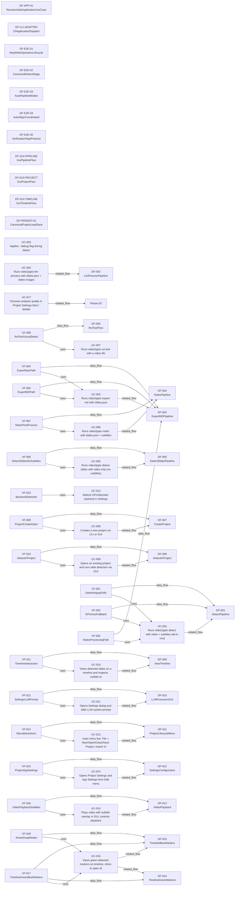

# GRACE Use Cases ↔ Flows

```mermaid
%% GRACE Use Cases ↔ Flows
flowchart LR
  DF_001["DF-001<br/>DetectPipeline"]
  DF_002["DF-002<br/>ExportMDPipeline"]
  DF_003["DF-003<br/>LlmProcessPipeline"]
  DF_004["DF-004<br/>NotesPipeline"]
  DF_005["DF-005<br/>DetectSlidesPipeline"]
  DF_006["DF-006<br/>RoiToolFlow"]
  DF_007["DF-007<br/>CreateProject"]
  DF_008["DF-008<br/>DetectInProject"]
  DF_009["DF-009<br/>ViewTimeline"]
  DF_010["DF-010<br/>LLMProcessInGUI"]
  DF_011["DF-011<br/>ProjectLifecycleMenu"]
  DF_012["DF-012<br/>SettingsConfiguration"]
  DF_013["DF-013<br/>VideoPlayback"]
  DF_014["DF-014<br/>TimelineGreenMarkers"]
  DF_015["DF-015<br/>TimelineBlueMarkers"]
  DF_APP_01["DF-APP-01<br/>RevisionSafeApplicationUseCase"]
  DF_CLI_ADAPTER["DF-CLI-ADAPTER<br/>CliApplicationDispatch"]
  DF_E2E_01["DF-E2E-01<br/>McpWriteOperationLifecycle"]
  DF_E2E_02["DF-E2E-02<br/>CanonicalDetectStage"]
  DF_E2E_03["DF-E2E-03<br/>AutoPipelineModes"]
  DF_E2E_04["DF-E2E-04<br/>AutoAlignCoordinated"]
  DF_E2E_05["DF-E2E-05<br/>VerificationStepProtocol"]
  DF_GUI_PIPELINE["DF-GUI-PIPELINE<br/>GuiPipelineFlow"]
  DF_GUI_PROJECT["DF-GUI-PROJECT<br/>GuiProjectFlow"]
  DF_GUI_TIMELINE["DF-GUI-TIMELINE<br/>GuiTimelineFlow"]
  DF_PERSIST_01["DF-PERSIST-01<br/>CanonicalProjectLoadSave"]
  Phase_20["Phase-20"]
  UC_001["UC-001<br/>Runs video2pptx detect with video + subtitles (all-in-one)"]
  UC_002["UC-002<br/>Runs video2pptx export-md with slides.json"]
  UC_003["UC-003<br/>Applies --debug flag during detect"]
  UC_004["UC-004<br/>Runs video2pptx llm-process with slides.json + slides images"]
  UC_005["UC-005<br/>Runs video2pptx detect-slides with video only (no subtitles)"]
  UC_006["UC-006<br/>Runs video2pptx notes with slides.json + subtitles"]
  UC_007["UC-007<br/>Runs video2pptx roi-tool with a video file"]
  UC_008["UC-008<br/>Creates a new project via CLI or GUI"]
  UC_009["UC-009<br/>Opens an existing project and runs slide detection via GUI"]
  UC_010["UC-010<br/>Views detected slides on a timeline and inspects subtitle te"]
  UC_011["UC-011<br/>Opens Settings dialog and edits LLM system prompt"]
  UC_012["UC-012<br/>Selects GPU/decoder backend in Settings"]
  UC_013["UC-013<br/>Uses menu bar: File > New/Open/Close/Save Project, Import Vi"]
  UC_014["UC-014<br/>Opens Project Settings and App Settings from Edit menu"]
  UC_015["UC-015<br/>Plays video with subtitle overlay in GUI, controls playback "]
  UC_016["UC-016<br/>Views green detected markers on timeline, clicks to open sli"]
  UC_017["UC-017<br/>Chooses analysis quality in Project Settings (fast / detaile"]
  VF_001["VF-001<br/>DetectHappyPath"]
  VF_002["VF-002<br/>ExportMDPath"]
  VF_003["VF-003<br/>GPUAutoFallback"]
  VF_004["VF-004<br/>ExportPptxPath"]
  VF_005["VF-005<br/>NotesProcessingPath"]
  VF_006["VF-006<br/>DetectSlidesNoSubtitles"]
  VF_007["VF-007<br/>NotesPostProcess"]
  VF_008["VF-008<br/>RoiToolVisualSelect"]
  VF_009["VF-009<br/>ProjectCreateOpen"]
  VF_010["VF-010<br/>DetectInProject"]
  VF_011["VF-011<br/>TimelineInteraction"]
  VF_012["VF-012<br/>SettingsLLMPrompt"]
  VF_013["VF-013<br/>BackendSelection"]
  VF_014["VF-014<br/>MenuBarActions"]
  VF_015["VF-015<br/>ProjectAppSettings"]
  VF_016["VF-016<br/>VideoPlaybackSubtitles"]
  VF_017["VF-017<br/>TimelineGreenBlueMarkers"]
  VF_018["VF-018<br/>SmartSnapModes"]

  UC_001 -->|related_flow| DF_001
  UC_002 -->|related_flow| DF_002
  UC_004 -->|related_flow| DF_003
  UC_005 -->|related_flow| DF_005
  UC_006 -->|related_flow| DF_004
  UC_008 -->|related_flow| DF_007
  UC_009 -->|related_flow| DF_008
  UC_010 -->|related_flow| DF_009
  UC_011 -->|related_flow| DF_010
  UC_013 -->|related_flow| DF_011
  UC_014 -->|related_flow| DF_012
  UC_015 -->|related_flow| DF_013
  UC_016 -->|related_flow| DF_014
  UC_016 -->|related_flow| DF_015
  UC_017 -->|related_flow| Phase_20
  VF_001 -->|uses| UC_001
  VF_001 -->|data_flow| DF_001
  VF_002 -->|uses| UC_002
  VF_002 -->|data_flow| DF_002
  VF_003 -->|uses| UC_001
  VF_003 -->|data_flow| DF_001
  VF_004 -->|uses| UC_002
  VF_004 -->|data_flow| DF_002
  VF_005 -->|uses| UC_001
  VF_005 -->|data_flow| DF_002
  VF_006 -->|uses| UC_005
  VF_006 -->|data_flow| DF_005
  VF_007 -->|uses| UC_006
  VF_007 -->|data_flow| DF_004
  VF_008 -->|uses| UC_007
  VF_008 -->|data_flow| DF_006
  VF_009 -->|uses| UC_008
  VF_009 -->|data_flow| DF_007
  VF_010 -->|uses| UC_009
  VF_010 -->|data_flow| DF_008
  VF_011 -->|uses| UC_010
  VF_011 -->|data_flow| DF_009
  VF_012 -->|uses| UC_011
  VF_012 -->|data_flow| DF_010
  VF_013 -->|uses| UC_012
  VF_014 -->|uses| UC_013
  VF_014 -->|data_flow| DF_011
  VF_015 -->|uses| UC_014
  VF_015 -->|data_flow| DF_012
  VF_016 -->|uses| UC_015
  VF_016 -->|data_flow| DF_013
  VF_017 -->|uses| UC_016
  VF_017 -->|data_flow| DF_014
  VF_017 -->|data_flow| DF_015
  VF_018 -->|uses| UC_016
  VF_018 -->|data_flow| DF_015
```
